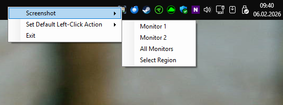
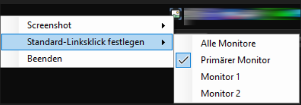

# ScreenshotApp

Simple Windows Taskbar Sreenshot App
Left-click the tray icon to save a screenshot in the "User/MyPictures/Screenshots" folder.

---

## 📚 Screenshots

 

---

## ⏬ Download

Download the latest version of the application:

[Latest Release](https://github.com/git3654/ScreenshotTrayApp/releases/latest)

---
